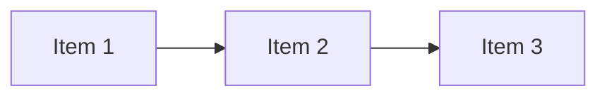

# Risk Assessment

Analyze the project for delivery risks and provide a structured risk assessment.

## Instructions

1. Review open issues, PRs, and milestones
2. Identify blocked items and their blockers
3. Check for dependency chains that could cascade delays
4. Analyze velocity trends (if data available)
5. Rate each risk by probability × impact
6. Recommend mitigations

## Risk Assessment Template

```markdown
## Risk Assessment: [Project/Sprint Name]

**Date**: [Assessment date]
**Overall Risk Level**: 🟢 Low / 🟡 Medium / 🔴 High

### Summary
[2-3 sentence overview of the project's risk posture]

### Risk Register

| # | Risk | Probability | Impact | Level | Mitigation |
|---|------|-------------|--------|-------|------------|
| 1 | [Risk description] | High | High | 🔴 | [Mitigation] |
| 2 | [Risk description] | Medium | High | 🟡 | [Mitigation] |
| 3 | [Risk description] | Low | Medium | 🟢 | [Mitigation] |

### Blocked Items
| Item | Blocker | Days Blocked | Impact |
|------|---------|-------------|--------|
| [Issue/PR] | [What's blocking] | [N] | [Downstream impact] |

### Dependency Analysis


### Velocity Trend
| Sprint | Planned | Delivered | Delta |
|--------|---------|-----------|-------|
| N-2 | X | Y | -Z |
| N-1 | X | Y | +Z |
| N | X | ? | — |

### Recommendations
1. [Priority action item]
2. [Secondary action item]
3. [Long-term improvement]
```

## Risk Scoring

| | Low Impact | Medium Impact | High Impact |
|---|-----------|---------------|-------------|
| **High Probability** | 🟡 Medium | 🔴 High | 🔴 Critical |
| **Medium Probability** | 🟢 Low | 🟡 Medium | 🔴 High |
| **Low Probability** | 🟢 Low | 🟢 Low | 🟡 Medium |
